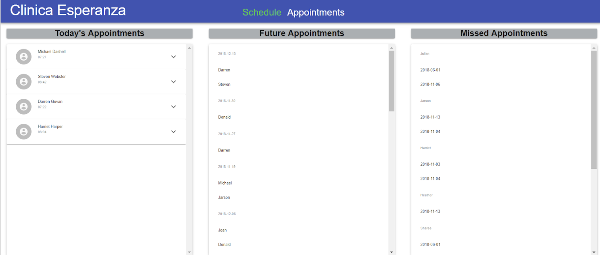
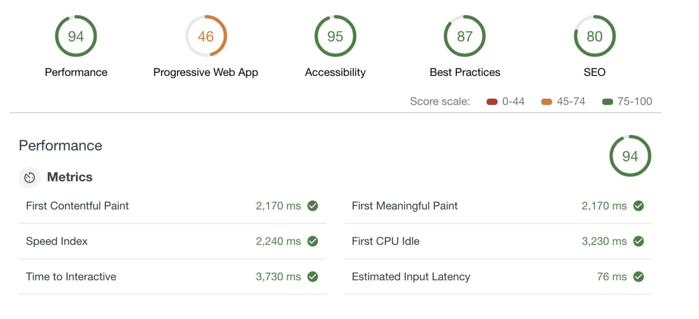

# Overview 
Led an agile development team of three others through the products lifecycle for a remote client in Roatán Honduras to notify patients in remote areas that have appointments. I was responsible for configuring the backend using Mongo and Node.js, implementing SMS messaging through 3rd party services, and containerized everything using Docker. What we gave our client was a more robust product with user auth, a encrypted database, messaging, and an intutive UI. 

## WhatsAppSpike
This is a Spike for where I learned how to implement WhatsApp into our app. 

## About 
A React App for a clinic based in Roatán, Honduras to notify and manage patients in remote areas that have appointments.

## Current State

 
 
    
 

 
 ## Basic Performance Testing Of the Current State
  
 
    
 

